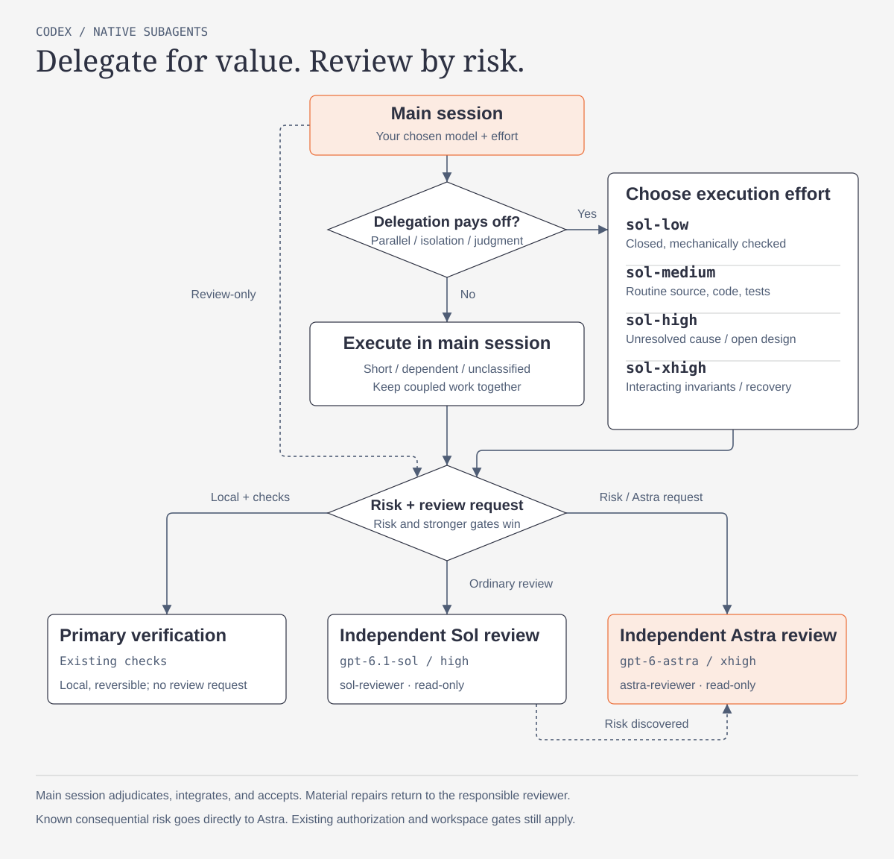

[English](README.md) | [简体中文](README.zh-CN.md)

# Codex Subagent Router

A global delegation policy with four Sol execution roles and two independent, read-only reviewers. The main session owns requirements and overall design, and keeps the model and reasoning effort selected by the user. Short, connected, or unclassified tasks stay in the main session.

## Routing at a glance



Execution effort follows unresolved uncertainty and interacting invariants. Review follows concrete risk and required gates. Both reviewers return findings to the main session for adjudication; this policy guides native Codex routing rather than enforcing a token budget.

Role names identify execution effort or review responsibility; their model bindings live in the role files and table below. Installation backs up and removes the old `sol-low`, `sol-medium`, `sol-high`, `sol-xhigh`, `sol-reviewer`, and `astra-reviewer` files, then installs the six new names without aliases. The model, effort, and read-only boundaries are unchanged. Restart Codex or use a freshly initialized session to reload the role definitions; already-running children are not evidence that migration was loaded.

## Delegate when it helps

Delegate a task only when its goal, scope, dependencies, and acceptance checks are clear, and parallel work, context isolation, or independent judgment provides a concrete benefit. Otherwise, do the work directly. A bounded design investigation can qualify before the full design exists; `worker-high` can explore the open questions.

| Role | Model | Effort | Typical work |
| --- | --- | --- | --- |
| `worker-low` | `gpt-6.1-sol` | `low` | Bounded work with few decisions and clear checks. |
| `worker-medium` | `gpt-6.1-sol` | `medium` | Routine implementation and investigation with local judgment. |
| `worker-high` | `gpt-6.1-sol` | `high` | Unresolved causes, cross-module compatibility, or open design requiring judgment. |
| `worker-xhigh` | `gpt-6.1-sol` | `xhigh` | Multiple interacting invariants across concurrency, migration, or recovery paths. |
| `reviewer` | `gpt-6.1-sol` | `high` | Independent, read-only review of ordinary features and generic review requests. |
| `risk-reviewer` | `gpt-6-astra` | `xhigh` | Independent, read-only review of concrete consequential risks or explicit Astra requests. |

Choose effort from the task's reasoning needs. The four Sol roles do not override sandbox or permission settings: each assignment must state whether it is read-only or owns a limited write scope. Parallel writers require disjoint file ownership or isolated worktrees. Delegation preserves the user's authorization.

Before spawning, weigh the specific parallel, isolation, or judgment benefit against startup, repeated reading, and integration work. Keep sequential edits and tasks requiring frequent intermediate exchanges with one executor. Choose the lowest effort sufficient for the actual uncertainty; cost targets do not justify downgrading consequential work.

Routine investigation, implementation, and test fixes use `worker-medium`. A state field, many files, task length, or a domain keyword alone does not justify high/xhigh. Reassess once uncertainty is resolved, so routine execution does not inherit the design phase's effort. Luna remains a possible future mechanical-task experiment, not an installed route. The main model/effort remains the user's choice.

| Task | Routing decision |
| --- | --- |
| Fix a local formatting bug and run its existing check | Main session; a short sequence usually gains little from handoff. |
| Implement two substantial independent modules with separate files and checks | Delegate bounded work in parallel when the expected benefit exceeds coordination work. |
| Change a shared recovery protocol | Keep coupled decisions together; review a stable version with callers and necessary checks through Astra before the required action gate. |
| Review an ordinary feature or handle a generic review request | Independent `reviewer`, unless concrete consequential risk or a stronger gate requires Astra. |
| Explain an architecture or report progress | Main session unless independent investigation has concrete value; topic words alone do not require review. |

## Context and communication

Prefer an independent context (`fork_turns="none"` when supported). Supply the goal, necessary facts, ownership, dependencies, acceptance checks, and fixed evidence locations/versions together. Use full history only for a concrete history dependency. Evidence references do not replace reading the source and callers needed to verify the task.

Consolidate follow-up instructions. Send interim messages for changed requirements, blockers, or findings affecting correctness, ownership, or dependent work. Report completion and use native waits instead of repeated unchanged polls. Each child returns a concise result, changed artifacts/version and evidence locations, checks with results/coverage, and unresolved gaps or tool failures. Keep large logs in files; the main session verifies critical evidence according to risk.

The installer sets no global child model or effort default and installs no custom `default`, `explorer`, `owner`, `mechanical`, or `high-risk-owner`. Luna and Terra roles are retired. `max` is an explicit exception, not a resident role.

## Independent review and completion

Review-only requests go directly to risk selection, without first spawning an execution role. Classify review before dispatch:

| Scope | Review |
| --- | --- |
| Local, reversible change with clear checks | Main-session verification, unless independent review is requested or a mandatory gate applies. |
| Ordinary feature or generic review request | Independent read-only `reviewer` at `high`. |
| Concrete consequential security, permission, data-consistency, irreversible-operation, critical shared/recovery-protocol, or business judgment risk; explicit Astra request | Independent read-only `risk-reviewer` at `xhigh`. |

Name the invariant or failure consequence that requires Astra. Effort, Ultra, architecture, and domain keywords alone do not trigger it. A batch containing consequential risk goes directly to Astra, even when the main session uses Astra. Stronger workspace/user gates still apply; missing evidence does not waive required review.

If Sol review uncovers consequential risk, leave it unresolved and escalate the original evidence, findings, and affected scope to Astra. Do not automatically repeat the entire review. Astra owns rechecks of the escalated risk; unchanged Sol coverage remains valid at its reviewed version.

The main agent adjudicates findings against evidence and makes the corrections. Submit a stable batch with its callers and necessary checks, without delaying a required authorization, design, or external-action review gate. Material revisions return to the same reviewer for original findings and affected scope at the new version; unchanged coverage remains reusable only while its version is valid. No findings, or wording-only corrections, do not require repeated review. Recurring findings require root-cause/design correction before resubmission; a round limit never waives unresolved risks or required review. A finished child run does not establish business completion. The main agent owns integration, verification, and the final completion claim.

Use the fields actually exposed by the current spawn tool. If that tool prohibits model or effort overrides with full-history forks, use `fork_turns="none"` or a finite number of turns when overriding them. Role configuration can override spawn parameters. Check runtime records for actual model and effort when available.

## Install

Python 3.11 or newer is required.

```bash
./install.sh
```

Install into another Codex home:

```bash
./install.sh --codex-home /path/to/.codex
```

The installer adds the six role files and a managed policy block to the global `AGENTS.md`, enables subagents, and removes global `default_subagent_model` and `default_subagent_reasoning_effort` settings. It preserves the main model and effort, permissions, MCP configuration, user concurrency limits, unrelated guidance, and existing hooks and features. Replaced or retired files are backed up under `subagent-router-backups/` before migration. Invalid managed inputs, unsafe managed-file symlinks, and inline `agents` tables are rejected before profile writes; use an `[agents]` table or dotted keys. If an installation write fails, the installer attempts to restore every changed file and retains backups; incomplete recovery reports the backup location.

The policy applies globally; workspace instructions and role overrides still matter. No hook is installed or enabled. Restart Codex to reload the configuration. The installer does not edit shell startup files or install dependencies.

## Verify

```bash
python3 scripts/verify.py --codex-home ~/.codex
```

Run the repository tests:

```bash
PYTHONDONTWRITEBYTECODE=1 python3 -m unittest discover -s tests -v
```

These checks establish configuration and installer correctness, not runtime routing or performance. Use [task-level validation](docs/performance-validation.md) to compare natural tasks under the same acceptance criteria. The policy guides model decisions; it does not enforce a runtime token budget or promise a speedup.

## Repository layout

```text
agents/                 Four execution roles and two read-only reviewers
policy/                 Delegation, review, and ownership policy
scripts/install.py      Installer with input validation and backups
scripts/verify.py       Installed-state and source privacy checks
tests/                  Focused installer and contract tests
```

## Publishing safety

Keep personal data, company-internal information, credentials, host details, and absolute local paths out of commits and GitHub metadata.
