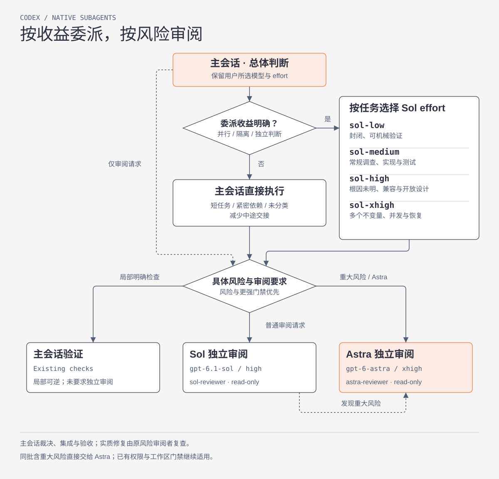

[English](README.md) | [简体中文](README.zh-CN.md)

# Codex Subagent Router

一套全局委派策略，提供四个 Sol 执行角色和两个独立的只读审阅角色。主会话负责需求与整体设计，保留用户手选的模型与推理强度；短任务、紧密关联的工作和未分类任务由主会话直接处理。

## 路由概览



执行 effort 按尚未解决的不确定性和相互影响的不变量选择，审阅按具体风险及必需门禁选择。两类审阅都返回主会话裁决；策略引导 Codex 原生路由，不强制执行 token 预算。

角色名体现执行 effort 或审阅责任，模型绑定放在角色文件和下表中。安装器备份并清理旧的 `sol-low`、`sol-medium`、`sol-high`、`sol-xhigh`、`sol-reviewer`、`astra-reviewer` 文件，安装六个新名称，不保留别名。模型、effort 和只读边界保持原样。重启 Codex 或使用重新初始化的会话加载新角色；已有子 Agent 的运行不能证明其已加载迁移。

## 何时委派

子任务的目标、范围、依赖和验收标准明确，并且并行执行、上下文隔离或独立判断能带来具体收益时，才进行委派。其他任务直接执行。专题设计可以在完整方案形成前委派，只要问题边界明确；`worker-high` 可以负责探索尚未解决的设计问题。

| 角色 | 模型 | 推理强度 | 常见任务 |
| --- | --- | --- | --- |
| `worker-low` | `gpt-6.1-sol` | `low` | 决策少、范围明确且检查标准清楚的工作。 |
| `worker-medium` | `gpt-6.1-sol` | `medium` | 需要局部判断的常规实现与调查。 |
| `worker-high` | `gpt-6.1-sol` | `high` | 根因未明、跨模块兼容，或需要判断的开放设计。 |
| `worker-xhigh` | `gpt-6.1-sol` | `xhigh` | 并发、迁移或恢复路径中多个不变量相互影响的工作。 |
| `reviewer` | `gpt-6.1-sol` | `high` | 常规功能和普通审阅请求的独立只读审阅。 |
| `risk-reviewer` | `gpt-6-astra` | `xhigh` | 具体重大风险或明确要求 Astra 的独立只读审阅。 |

按任务的推理需求选择强度。四个 Sol 角色不覆盖 sandbox 或权限设置；每次委派应明确只读要求，或限定可写范围及负责人。并行写入必须拥有互斥的文件范围或隔离工作树。委派不能扩大用户授权范围。

启动前，判断并行、隔离或独立判断的具体收益是否值得启动、重复读取和集成成本。连续修改同一模块、需要频繁交换中间结果的工作交给同一执行者。按实际不确定性选择足以完成任务的最低推理强度；不能为满足成本目标而降低重要任务的判断能力。

常规源码调查、实现和测试修复使用 `worker-medium`。状态字段、文件数量、任务长度或领域词本身不能作为 high/xhigh 的依据。不确定性解决后重新判断，避免常规实施沿用设计阶段的高 effort。Luna 留作后续机械任务试验，本轮不安装对应路由。主会话模型与 effort 仍由用户选择。

| 任务 | 路由选择 |
| --- | --- |
| 修复局部格式错误并运行已有检查 | 主会话完成；短小的连续步骤通常不值得交接。 |
| 实现两个有足够工作量、文件和检查相互独立的模块 | 收益超过协调成本时，委派明确范围并行完成。 |
| 修改共享恢复协议 | 将相互依赖的决策放在一起；形成包含调用方和必要检查的稳定版本，在所需操作门禁前交给 Astra 审查。 |
| 审阅常规功能或处理普通审阅请求 | 独立 `reviewer`；具体重大风险或更强门禁要求 Astra 时升级。 |
| 解释架构或汇报进度 | 主会话完成，除非独立调查有具体收益；领域词本身不触发审阅。 |

## 上下文与交接

默认优先使用独立上下文，工具支持时设置 `fork_turns="none"`。一次说明目标、必要事实、责任范围、依赖、验收标准和固定证据位置及版本。只有明确依赖历史时才分叉完整历史。证据引用不能代替核对任务所需的源码和调用方。

先汇总后续要求再发送。中途消息用于需求变化、阻塞，或影响正确性、责任范围及下游工作的关键发现。完成时交付结果；等待时使用原生等待机制，减少反复查询未变化的状态。子 Agent 简要返回结果、改动产物及版本、证据位置、检查结果和覆盖范围、未解决问题或工具失败。大日志保留在文件中，主会话按风险核对关键证据。

安装器不设置全局子 Agent 模型与强度默认值，不安装自定义 `default`、`explorer`、`owner`、`mechanical` 或 `high-risk-owner`，并清理旧 Luna、Terra 角色。`max` 仅用于显式例外，不作为常驻角色。

## 独立审查与完成判断

仅审阅请求直接按风险选择审阅角色，无需先启动执行角色。派发前先判断审阅类型：

| 范围 | 审阅方式 |
| --- | --- |
| 局部、可逆且有明确检查的修改 | 主会话验证；用户要求独立审阅或存在必需门禁时，执行相应审阅。 |
| 常规功能或普通审阅请求 | 独立只读 `reviewer`，effort 为 `high`。 |
| 权限、安全、数据一致性、不可逆操作、关键共享或恢复协议、重要业务判断等具体重大风险；明确要求 Astra | 独立只读 `risk-reviewer`，effort 为 `xhigh`。 |

说明需要 Astra 核对的不变量或失败后果。推理强度、Ultra、架构或领域词本身不触发 Astra。同一批次含重大风险时直接交给 Astra，主会话使用 Astra 也不能代替独立审阅。更强的工作区或用户门禁继续适用；证据不足不能免除必需审阅。

Sol 审阅发现重大风险时，保持未解决状态，将原始证据、发现及受影响范围交给 Astra，不默认重做整个批次。Astra 负责该风险的修后复查；未变化的 Sol 覆盖范围只有在原版本仍有效时才可复用。

主 Agent 根据证据裁决发现并修改。将实现、调用方和必要检查形成稳定批次后送审，但不能因此延后必需的授权、设计或外部操作审查门禁。实质修正后，由同一审查者复查原发现及新版本的受影响范围；未变化的覆盖范围只有在版本仍有效时才可复用。没有发现或仅修正措辞时，无需反复审查。同类问题反复出现时，先修正根因或设计再送审；不能以轮次上限跳过未解决风险或必需审查。子任务运行结束不能证明业务已完成；主 Agent 负责集成、验证和最终完成声明。

只使用当前启动工具实际支持的字段。若工具禁止在完整历史分叉时覆盖模型或推理强度，显式覆盖时应使用 `fork_turns="none"` 或有限轮次。角色配置可能覆盖启动参数；有运行记录时，以记录确认实际模型与强度。

## 安装

需要 Python 3.11 或更新版本。

```bash
./install.sh
```

安装到其他 Codex 目录：

```bash
./install.sh --codex-home /path/to/.codex
```

安装器写入六个角色文件与全局 `AGENTS.md` 中的受管策略块，启用 subagents，并移除全局 `default_subagent_model` 和 `default_subagent_reasoning_effort` 设置。主会话模型与强度、权限、MCP 配置、用户并发限制、无关指引以及已有 hooks 和 features 设置均保留。替换或清理文件前，先备份到 `subagent-router-backups/`。受管输入不合法、受管文件存在不安全符号链接，或使用内联 `agents` 表时，在写入配置目录前拒绝安装；请使用 `[agents]` 表或点分键。安装写入失败时，逐一尝试恢复已改文件并保留备份；恢复不完整时，报告备份位置。

策略全局生效，仍需遵守工作区指引及角色覆盖设置。安装器不安装或启用 hook。重启 Codex 以重新加载配置。安装器不会修改 shell 启动文件或安装依赖。

## 验证

```bash
python3 scripts/verify.py --codex-home ~/.codex
```

运行仓库测试：

```bash
PYTHONDONTWRITEBYTECODE=1 python3 -m unittest discover -s tests -v
```

上述检查只证明安装器和配置正确，不证明实际路由或性能改善。按[任务级验证说明](docs/performance-validation.md)比较验收要求相同的自然任务。策略用于引导模型决策，不强制执行运行时 token 预算，也不保证提速。

## 仓库结构

```text
agents/                 四个执行角色与两个只读审阅角色
policy/                 委派、审查与职责策略
scripts/install.py      支持输入校验和备份的安装器
scripts/verify.py       安装状态与源文件隐私检查
tests/                  安装器与契约测试
```

## 发布安全

提交和 GitHub 元数据中不得包含个人信息、公司内部信息、凭据、主机信息或本地绝对路径。
